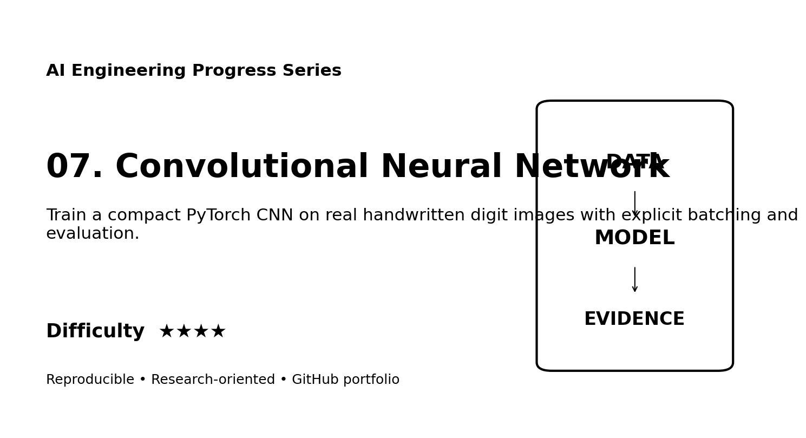
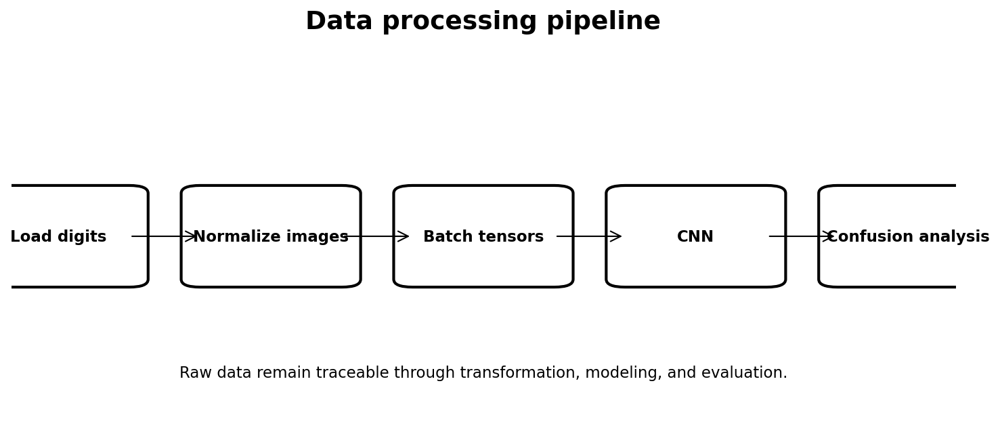
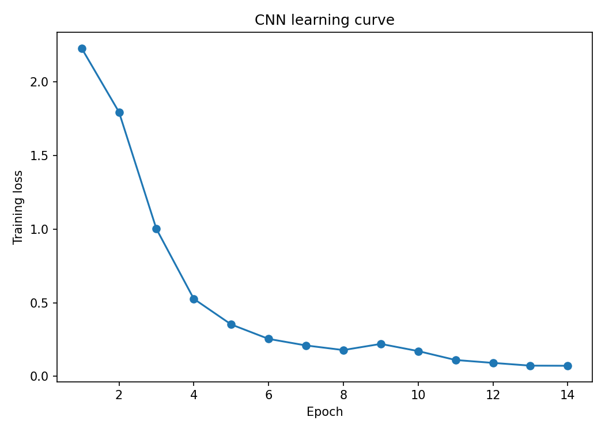
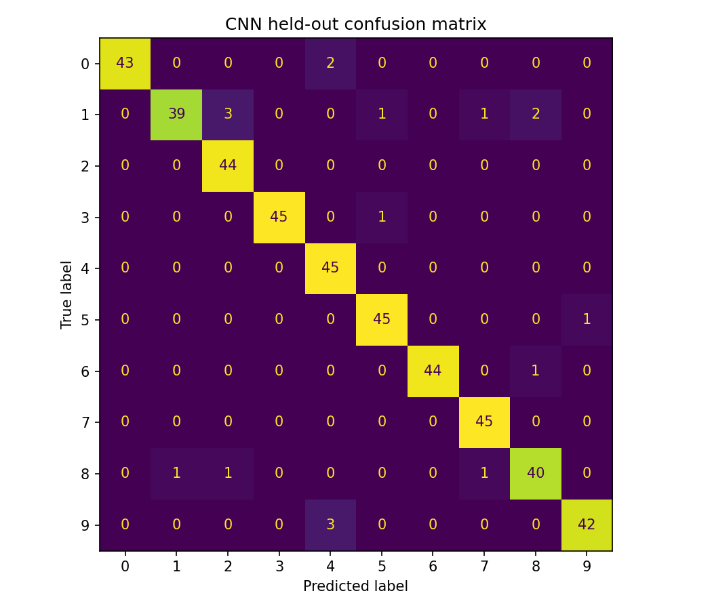

# Web Portfolio Card

## Convolutional Neural Network

**Track:** AI Engineering  
**Difficulty:** ★★★★  
**Dataset:** Optical Recognition of Handwritten Digits dataset  
**Quick description:** Train a compact PyTorch CNN on real handwritten digit images with explicit batching and evaluation.

### Suggested website image gallery

### Suggested portfolio copy
This project demonstrates PyTorch, CNN, computer vision, training loop using a reproducible workflow with explicit data provenance, processing, evaluation, limitations, and research documentation. The repository includes executable code and a scientific-style technical report suitable for supervisor review.
