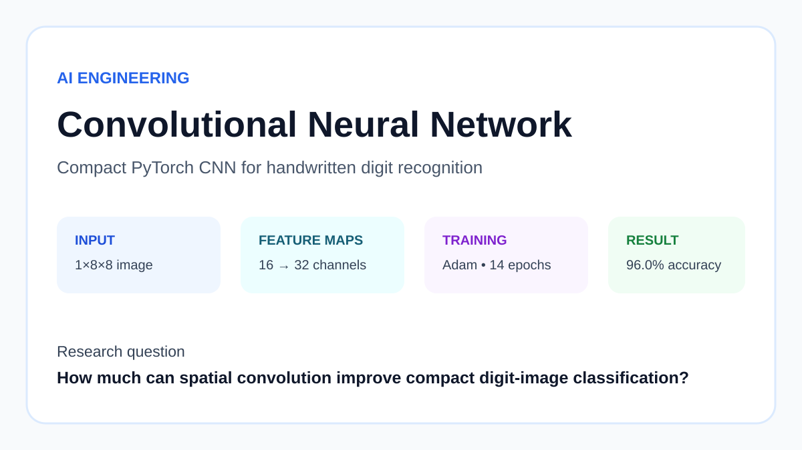
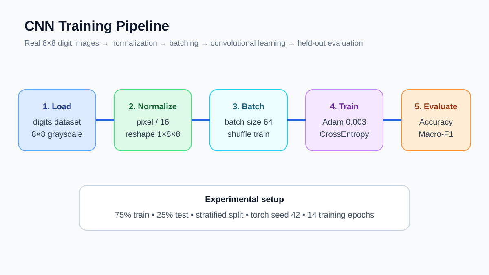
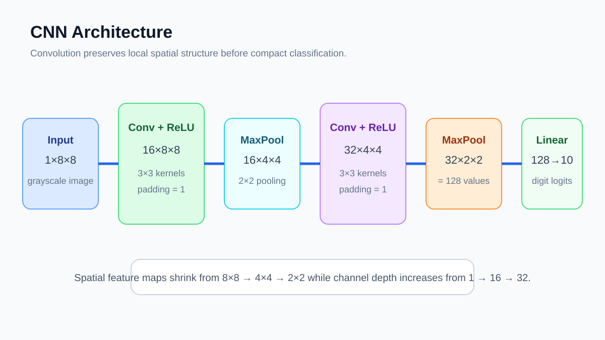

# 07. Convolutional Neural Network ★★★★



> **Quick description:** Train a compact PyTorch CNN on real handwritten digit images with explicit batching, optimization, and held-out evaluation.

## Why this project matters
This AI Engineering project demonstrates how convolutional neural networks preserve and exploit **local spatial structure** in image data. Unlike a fully connected network that immediately flattens the pixels, this model learns spatial feature maps before classification.

The project uses the real **Optical Recognition of Handwritten Digits** dataset, normalizes its 8×8 grayscale images, trains a two-stage convolutional network in PyTorch, and evaluates the trained model on a stratified held-out test set.

## Dataset
- **Dataset:** Optical Recognition of Handwritten Digits
- **Source:** scikit-learn `load_digits`
- **Samples:** 1,797 digit images
- **Image shape:** 8×8 grayscale
- **Classes:** digits 0–9
- **Normalization:** pixel values divided by 16
- **Data provenance and usage:** [DATA.md](DATA.md)

## Research pipeline


### Processing steps
1. Load the real handwritten-digit dataset.
2. Scale pixel intensities to approximately 0–1 by dividing by 16.
3. Reshape each sample to `1×8×8`.
4. Create a stratified 75/25 train-test split.
5. Train in shuffled mini-batches of 64.
6. Optimize the CNN with Adam at learning rate `0.003` using cross-entropy loss.
7. Evaluate the untouched test set with accuracy and macro-F1.

## CNN architecture


The implemented network is:

```text
1 × 8 × 8 input
      ↓
Conv2d: 1 → 16, 3×3, padding=1
ReLU
MaxPool2d: 2×2
      ↓
16 × 4 × 4
      ↓
Conv2d: 16 → 32, 3×3, padding=1
ReLU
MaxPool2d: 2×2
      ↓
32 × 2 × 2
      ↓
Flatten = 128 values
      ↓
Linear: 128 → 10
```

This architecture progressively reduces spatial resolution while increasing channel depth, allowing the network to learn local stroke patterns before producing ten class logits.

## Training and held-out evaluation


Generated metrics from the included experiment:

```json
{
  "accuracy": 0.96,
  "macro_f1": 0.9596695483330727,
  "epochs": 14
}
```

### Interpretation
- **Accuracy = 0.9600** means 96% of held-out digit images were classified correctly.
- **Macro-F1 = 0.9597** is nearly identical to accuracy, indicating performance is broadly balanced across the ten classes.
- The network was trained for **14 epochs** with Adam and cross-entropy loss.
- These results are specific to this dataset, split, architecture, and random seed.

## Reproduce
```bash
python -m venv .venv
source .venv/bin/activate   # Windows: .venv\Scripts\activate
pip install -r requirements.txt
python src/run_experiment.py
```

Metrics are written to `results/metrics.json`.

## Research documentation
- [Scientific-style technical report](paper/paper.md)
- [Quick description](QUICK_DESCRIPTION.md)
- [Website-ready portfolio entry](PORTFOLIO.md)
- [Data provenance](DATA.md)
- [Reproducibility notes](REPRODUCIBILITY.md)
- [Ethics and responsible use](ETHICS.md)
- [Citation metadata](CITATION.cff)

## Difficulty
**★★★★ — advanced**

## Academic integrity
This repository is a research portfolio artifact, not a peer-reviewed publication. Reported metrics are generated by the included code on the stated real dataset.

## Stronger research extension
A publication-oriented extension would add multiple random seeds, learning-rate and architecture ablations, dropout or weight-decay comparisons, data augmentation, calibration analysis, class-wise error inspection, and direct comparison against MLP and stronger CNN baselines.
