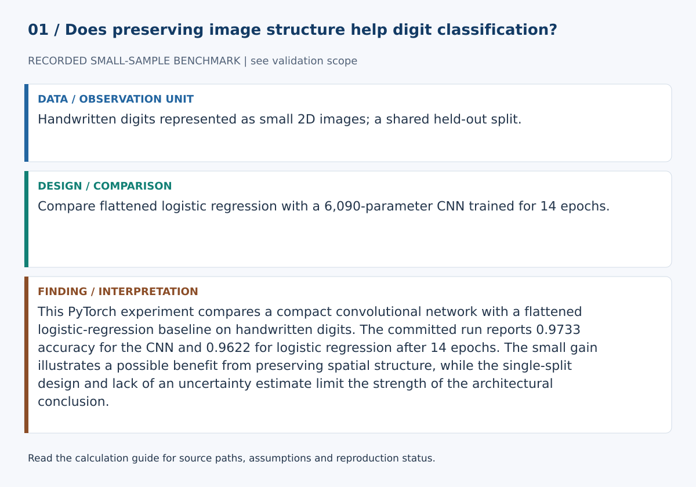
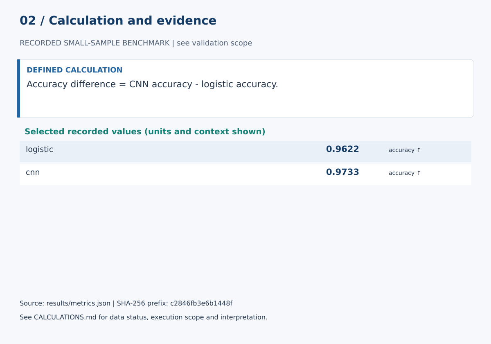

# Convolutional Neural Network for Handwritten Digits

## Abstract

This experiment compares a compact CNN with logistic regression on the scikit-learn handwritten-digits benchmark. The comparison tests whether preserving two-dimensional image structure improves classification relative to a flattened linear model.

## Method

Images are scaled to [0,1] and split 75/25 with stratification and seed 42. The CNN contains two convolution-pooling stages and a linear head, totaling 6,090 trainable parameters. It trains for 14 epochs with Adam and cross-entropy loss. Batch shuffling uses a seeded PyTorch generator.

## Results

Logistic regression reaches 0.9622 accuracy and 0.9620 Macro-F1. The CNN reaches 0.9733 accuracy and 0.9729 Macro-F1.

## Interpretation

The CNN improves on the flattened linear baseline in this run, suggesting that a spatial inductive bias is useful even on this small 8×8 dataset. The result complements the MLP project, where extra nonlinear complexity did not improve on the linear baseline.

## Limitations

The benchmark is very small. Repeated seeds, validation-based tuning, robustness analysis, and larger image datasets are needed for stronger claims.

## Calculation definitions and evidence audit

Accuracy difference = CNN accuracy - logistic accuracy.

The recorded difference is about 1.11 percentage points on one split. This is not an uncertainty interval or evidence of broad image-recognition superiority. The MLP repository uses a different preprocessing setup and is not a direct cross-repository benchmark.

This PyTorch experiment compares a compact convolutional network with a flattened logistic-regression baseline on handwritten digits. The committed run reports 0.9733 accuracy for the CNN and 0.9622 for logistic regression after 14 epochs. The small gain illustrates a possible benefit from preserving spatial structure, while the single-split design and lack of an uncertainty estimate limit the strength of the architectural conclusion.

The [calculation guide](../CALCULATIONS.md) provides exact evidence paths and a function-level implementation map.

### Selected evidence and interpretation

| Quantity | Value | Unit / meaning | JSON path |
|---|---:|---|---|
| logistic | 0.9622222222222222 | accuracy ↑ | `logistic.accuracy` |
| cnn | 0.9733333333333334 | accuracy ↑ | `cnn.accuracy` |

These values are read from `results/metrics.json`. They must be interpreted with the split, data status and limitations above. The complete data/model experiment was not rerun in this review.

### Reproduction and claim boundaries

The existing suite requires unavailable dependencies; no full-suite pass is claimed. The figure generator can be checked with `python scripts/build_review_figures.py --check`. This verifies the displayed calculation evidence, not an independent replication of the complete scientific experiment. The manuscript is a working report, not a peer-reviewed publication.
